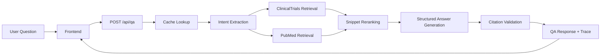

# Clinical QA MVP Slides Outline

This deck is aligned to the code that currently exists in this repo. It is no longer a pure hypothetical architecture deck. It is a walkthrough of a working local MVP.

## Slide 1. What I Built

### Title

`Clinical QA MVP Grounded in ClinicalTrials.gov and PubMed`

### What To Show

- One-sentence product definition
- One-sentence non-goal
- Tech stack:
  - `FastAPI`
  - `React + Vite`
  - `SQLite cache`
  - `OpenAI / vLLM configurable`

### What To Say

- This is an evidence-grounded QA system, not a diagnosis engine.
- The system retrieves live evidence, synthesizes it conservatively, and shows citations and trace data.

## Slide 2. User Experience

### What To Show

- Input: single clinical question
- Output blocks:
  - direct answer
  - why this answer
  - limitations
  - citations
- Extra UI:
  - source drawer
  - pipeline trace drawer

### What To Say

- I optimized the frontend for inspectability, not for conversational polish.
- Users can inspect both the cited source and the backend processing trace.

## Slide 3. End-to-End Architecture

### What To Show

### What To Say

- `qa.py` is the orchestration layer.
- The backend is modular: retrieval, rerank, generation, validation, and response assembly are separate steps.

## Slide 4. Real Pipeline Stages

### What To Show

- `cache`
- `intent`
- `clinical_trials_retrieval`
- `pubmed_retrieval`
- `rerank`
- `answer_generation`
- `citation_validation`
- `final_response`

### What To Say

- These are the exact stages exposed in the product's pipeline trace UI.
- If an answer is wrong, I can inspect which stage caused the failure.

## Slide 5. ClinicalTrials.gov Retrieval

### What To Show

- `query.cond`
- `query.intr`
- `query.term` fallback
- status-aware behavior:
  - `recruiting`
  - `ongoing`

### What To Say

- Trial search is source-aware, not generic full-text search.
- I preserve trial semantics like status, phase, eligibility, and outcomes.
- One real bug I fixed was avoiding the case where recruiting trials were missed because filtering happened after truncation.

## Slide 6. PubMed Retrieval

### What To Show

- `esearch`
- `esummary`
- `efetch`
- abstract-grounded normalization

### What To Say

- PubMed uses a completely different retrieval path from trials.
- I build PubMed-style search terms from condition, intervention, and outcome cues.
- The current MVP is abstract-grounded and honest about that limitation.

## Slide 7. Reranking And Evidence Packaging

### What To Show

- Hybrid score:
  - source rank
  - keyword overlap
  - embedding cosine when available
- Source diversity cap
- Snippet types:
  - trial status / summary / eligibility / outcomes
  - paper title / metadata / abstract chunks

### What To Say

- I use a bounded reranker rather than a full vector database in this MVP.
- I also limit over-concentration from a single source so one paper does not dominate the evidence window.

## Slide 8. LLM Layer And Grounding

### What To Show

- Provider-neutral chat layer:
  - `CHAT_PROVIDER=openai|vllm`
  - `EMBED_PROVIDER=openai|vllm|none`
- Structured outputs:
  - `QuestionIntent`
  - `QAAnswerDraft`
- Safeguards:
  - thinking strip
  - citation normalization
  - fallback answer

### What To Say

- The LLM is used as a constrained synthesizer, not as a source of truth.
- The backend validates or normalizes citations before building the final response.

## Slide 9. Three Real Questions

### What To Show

- `Q1` pembrolizumab in metastatic TNBC -> `trials`
- `Q2` semaglutide safety in obesity -> `pubmed`
- `Q3` CAR-T in multiple myeloma -> `blended`

### What To Say

- These three questions are useful because together they exercise all three routing modes.
- They also expose realistic edge cases in retrieval and synthesis.

## Slide 10. Tradeoffs And Next Steps

### What To Show

- Live retrieval + cache vs offline ingestion
- Bounded reranking vs vector DB
- Abstract-grounded PubMed vs full-text pipeline
- Stronger blended-answer planning

### What To Say

- The current code chooses the simpler, more debuggable MVP.
- The next production steps are better indexing, stronger evaluation, and better multi-source synthesis.

## Suggested Visual Style

- Clean white background
- Dark text
- Blue-green accent
- One architecture diagram
- One pipeline trace slide
- One real examples slide
- Keep each slide to `3-5` main points
